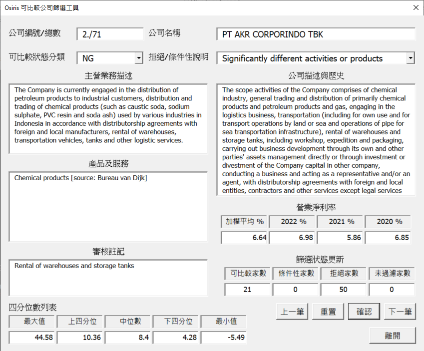

# osiris_data_screening
## General Description: 
This is an Excel utility program developed in VBA supporting Osiris data screening, real time PLI calculation and other common functionalities.

Ver. 0.1e  
Date: 2024/4/23  
Author: maoyi.fan@yapro.com.tw

## Installations
* This program is supposed to be installed or attached to ThisWorkbook of PERSONAL.XLSB so that functions implemented in this program can be executed on any Excel file from Osiris comparable company search.

## Structure
As of the time this document is edited, this program includes the following VBA files or forms:
1. PLIDetailsForm.frm: The GUI of this program, see the screenshot below, which includes 
      * company information stored in "列表 (2)" of the Osiris search result file. 
      * the financial data of the latest three years and the average one. Financial information or to be more specific, PLI (Profit Level Indicator) may be either operating margin(OM, 營業淨利率) or net cost plus(NCP, 成本及營業費用淨利率), based on the way this program is launched. 
      * the statistics reflecting the current review or categorization results, i.e. displaying the number of comparable companies, conditionally accept companies, non-comparable companies and unscreened ones
      * average quartile which forms the regular trading range.
2. ThisWorkbook.cls: This files includes a number of shortcut keys hookup to the correspondent VBA macros. Two important shortcut mappings related to this Osiris data screening functions are
      * Ctrl-Shift-O: hooks up the subroutine CompanyOMDetails() 
      * Ctrl-Shift-N: hooks up the subroutine CompanyNCPDetails() 
3. Common_Utilities.bas: This file includes the actual anchors that keypad shortcuts defined in ThisWorkbook.cls hooks up. It also includes other VBA utilities common to all Excel file instances.
4. Osiris_Review_Constant.bas: This file is a constants container defining VBA constants for operation of this data screening tool, especially those related to the worksheet layout definitions. This file includes string constants to build the GUI as well.
5. Osiris_Review_Gadgets.bas: This VBA file includes customized data types, Quartile calculation routine, screening statistics routine, worksheet geometry support utilities, string operation routines... , etc.
 

## Discussions
1. ver. 0.1e implemented basic functionalities using basic coding skills. Migration to a class based implementation may be a way to an organized program when more complicated functionalities are necessary.

## ToDo's
1. Add message box at the exit of UserFrame to determine if a file save is necessary
2. Add country lookup formula when creating the worksheets OM_Comparables and NCP_Comparables
